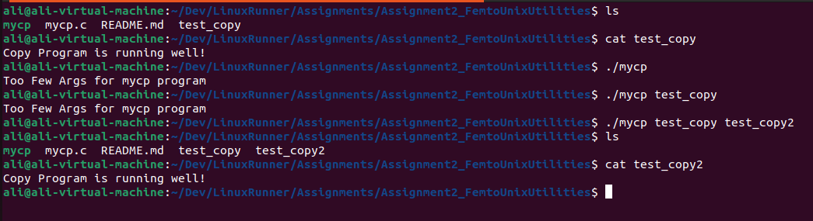
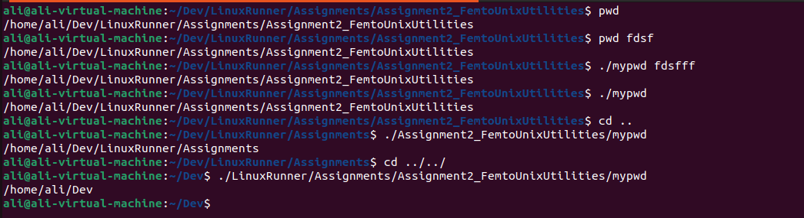

#Assignment2 Femto Unix Utilities. 

mycp:

It's a simple c program similer to cp in linux that take 2 Arguments and copy first one content into the second and keep the original one.

Syntax: 
 ./mycp Source Target
 
  e.g. ./mycp test_copy test_copy2

this program uses Libraries: 
	- stdio
	- unistd
	- sys/types
	- sys/stat
	- fcntl

This program handles cases like too many or few arguments, copy the whole content whatever its length.

mypwd: 

It's a simple C program similer to pwd command in linux take no options.

Syntax:
 ./mypwd

this program uses Libraries:
        - stdio
        - unistd

