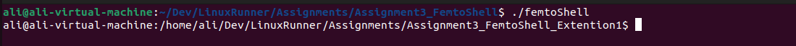
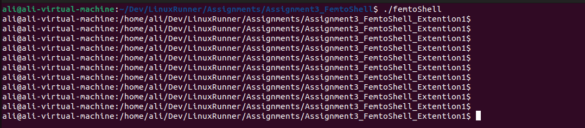
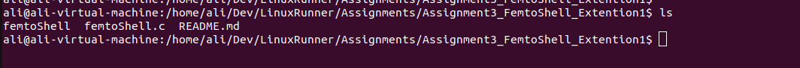
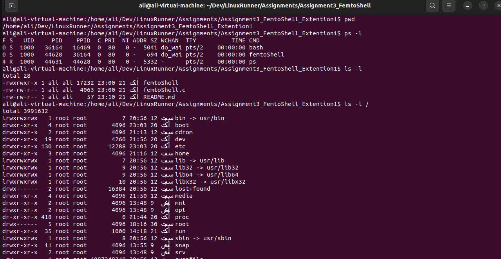
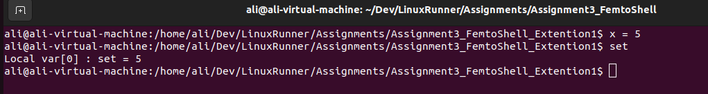
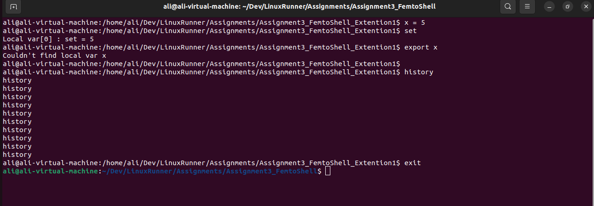

#Assignment3 FemtoShell Extenstion

This progrm is a simple shell with some features  of the real shell. 

It supports: 

- prompt like real shell
- give name of the program search for it and run
- Accept more than Argument or option
- Handles newline Entry
- Store entry command to history
- storing local variables
- Setting local var to Env vars

How it works?! 

- first print the prompt
- take the input,
- check if it a newline (ignore)
- otherwise pass the input to the parser
- parser checks if the input a built in command, so excute it
- or it's assignment for a local variable,
- finally, checks if it's external command then excute it.

Used Libraries: 
#include <stdio.h>
#include <string.h>
#include <stdlib.h>
#include <unistd.h>
#include <sys/types.h>
#include <sys/wait.h>
#include <sys/utsname.h>

Some Outputs: 

- Shell Prompt:

- Handling Newlines entry:

- using short External Commands: 

- using Extenal Commands with args: 

- Assigning new local variable: 

- using built-in commands and set local var to env vars:

 

